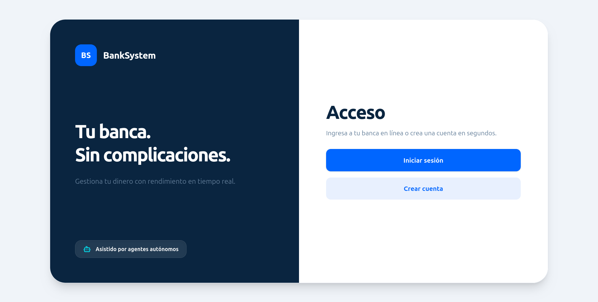
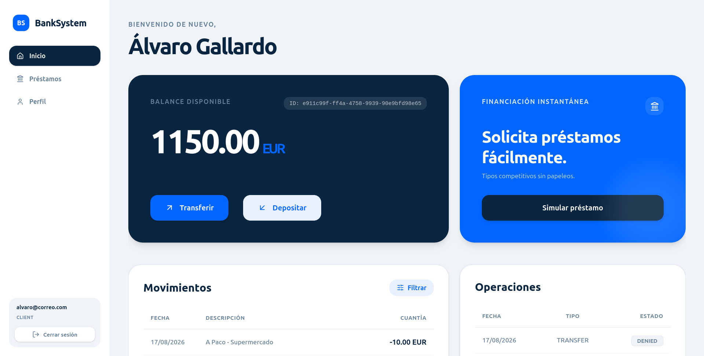

<pre>
█████▄  ▄▄▄  ▄▄  ▄▄ ▄▄ ▄▄ ▄█████ ▄▄ ▄▄  ▄▄▄▄ ▄▄▄▄▄▄ ▄▄▄▄▄ ▄▄   ▄▄ 
██▄▄██ ██▀██ ███▄██ ██▄█▀ ▀▀▀▄▄▄ ▀███▀ ███▄▄   ██   ██▄▄  ██▀▄▀██ 
██▄▄█▀ ██▀██ ██ ▀██ ██ ██ █████▀   █   ▄▄██▀   ██   ██▄▄▄ ██   ██ 
</pre>

  
  

# Documentación

## Core

* **API REST (OpenAPI / Swagger UI):** 
    `http://${HOST}:${SERVER_PORT}/swagger-ui/index.html` 
    En desarrollo local: [http://localhost:8080/swagger-ui/index.html](http://localhost:8080/swagger-ui/index.html)

* **API Event-Driven (AsyncAPI / Springwolf UI):** 
    `http://${HOST}:${SERVER_PORT}/springwolf/asyncapi-ui.html` 
    En desarrollo local: [http://localhost:8080/springwolf/asyncapi-ui.html](http://localhost:8080/springwolf/asyncapi-ui.html)

> **Nota:** `${HOST}` y `${SERVER_PORT}` corresponden al nombre del host y puerto donde se despliegue el servicio (definido en la variable `SERVER_PORT` del archivo `.env`).

## Agentic

